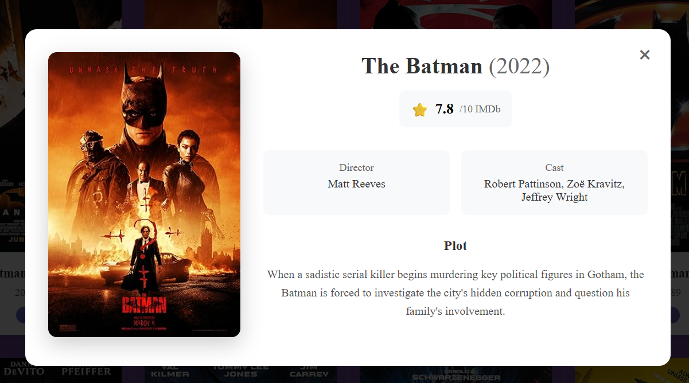

# 🎬 OMDB Movie Explorer – Frontend

A modern, responsive frontend application built with **React + Vite** for exploring movies and series using the **OMDB API** via a backend service.

This UI allows users to search movies, browse results in a grid, and view detailed movie information.

---

## 🚀 Tech Stack

- **React 18**
- **Vite**
- **JavaScript (ES6+)**
- **Tailwind CSS**
- **Fetch API**
- **ESLint**

---

## ✨ Features

- 🔍 Search movies and series by title
- 🖼️ Responsive movie grid with posters
- 📄 Detailed movie view (plot, actors, director, ratings)
- ⚡ Fast development with Vite + HMR
- 🌍 Environment-based API configuration
- 📱 Mobile-friendly UI

---

## 📁 Project Structure
```
-src/
-├── components/
-│ └── MovieExplorer.jsx # Main movie search and display component
-├── config/
-│ └── api.js # API base URL configuration (from .env)
-├── App.jsx # Root application component
-├── main.jsx # Application entry point
-└── index.css # Global styles
```


## 🔧 Environment Configuration

### 1️⃣ Create `.env` file

Create a `.env` file in the root of the frontend project:

```bash
VITE_API_BASE_URL=http://localhost:8080/api
```

## ▶️ Running the Project Locally

### Install Dependencies
```bash
npm install
```

### Start Development Server
```bash
npm run dev
```

### The application will run at:
```bash
http://localhost:5173
```

### Backend Dependency

- This frontend requires the OMDB Movie Explorer Backend (Spring Boot) to be running.

### Backend Base URL:
```bash
http://localhost:8080
```

### API Endpoints Used

- GET /api/movies/search?title={query}

- GET /api/movies/{imdbId}

### Build for Production
```bash
npm run build
```
### Preview Production Build Locally
```bash
npm run preview
```

### Linting

Run ESLint checks:
```bash
npm run lint
```

### Best Practices Followed

- Environment-based configuration

- No hardcoded API URLs

- Clean and reusable components

- Responsive UI design

- ESLint enabled for code quality

Separation of concerns

📸 Screenshots (Optional)

Add screenshots here for better presentation.



📄 License

### This project is created for educational and evaluation purposes.

### 🙌 Acknowledgements

- OMDB API